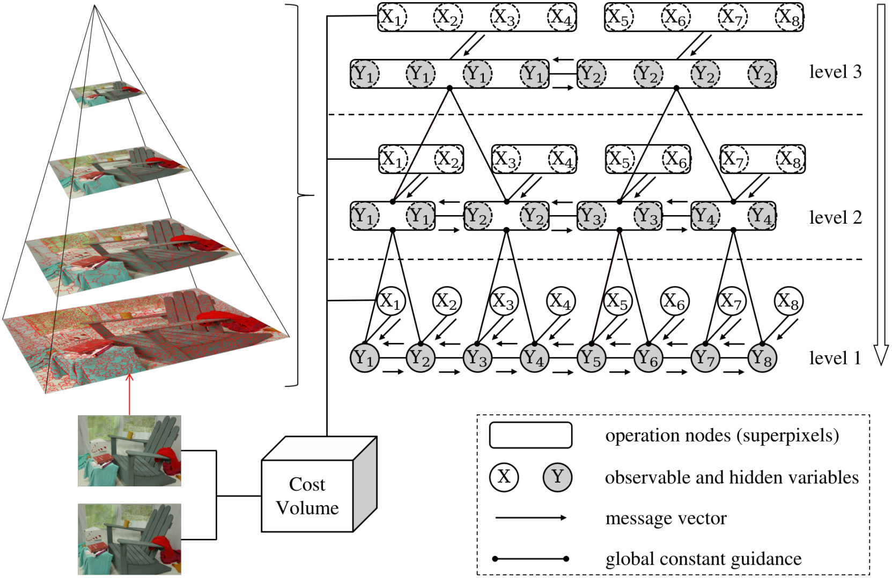
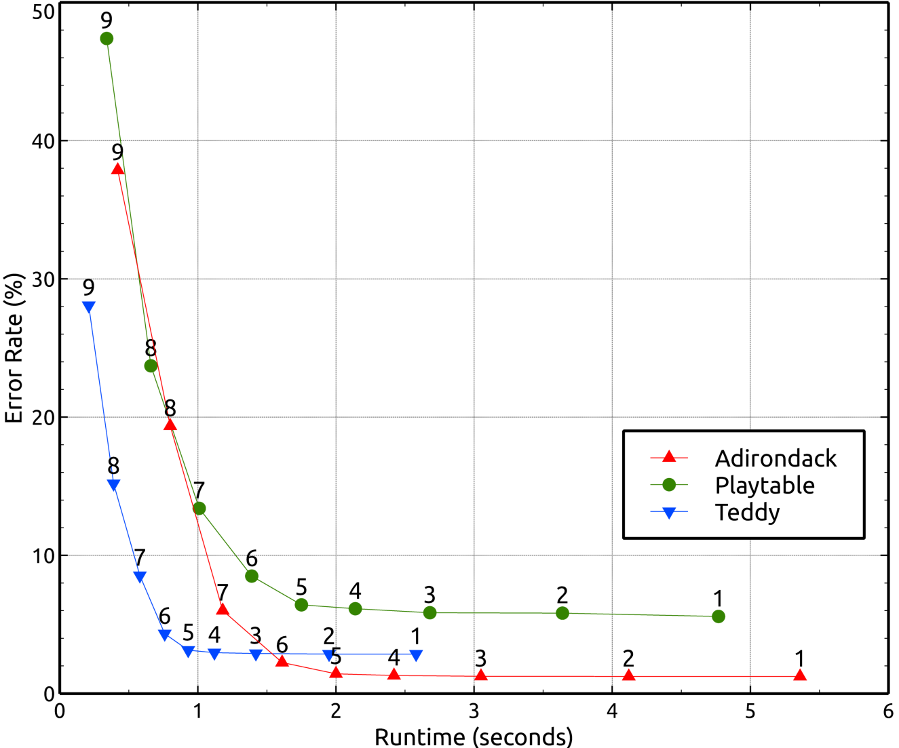

# Hierarchical Belief Propagation on Image Segmentation Pyramid
# Workflow

# Dependency
- CUDA >= 6.0
- OpenCV >= 3.0
# Usage
Compile the code
```
bash build.sh
```
Test on the Middlebury V3 benchmark
```
bash bench_MiddV3_train.sh
```
Test on a single stereo pair
```
bash test_stereo_hbp_isp.sh
```
# Inference time on a NVIDIA Titan Xp GPU


If you find this work useful, please cite the our [[paper](https://ieeexplore.ieee.org/document/10198437)] and the superpixel [[paper](https://ieeexplore.ieee.org/document/9819438)] 
```
@ARTICLE{10198437,
  author={Yan, Tingman and Yang, Xilian and Yang, Genke and Zhao, Qunfei},
  journal={IEEE Transactions on Image Processing}, 
  title={Hierarchical Belief Propagation on Image Segmentation Pyramid}, 
  year={2023},
  volume={32},
  number={},
  pages={4432-4442},
  doi={10.1109/TIP.2023.3299192}}

@ARTICLE{9819438,
author={Yan, Tingman and Huang, Xiaolin and Zhao, Qunfei},
journal={IEEE Transactions on Image Processing},
title={Hierarchical Superpixel Segmentation by Parallel CRTrees Labeling},
year={2022},
volume={31},
number={},
pages={4719-4732},
doi={10.1109/TIP.2022.3187563}}
```
